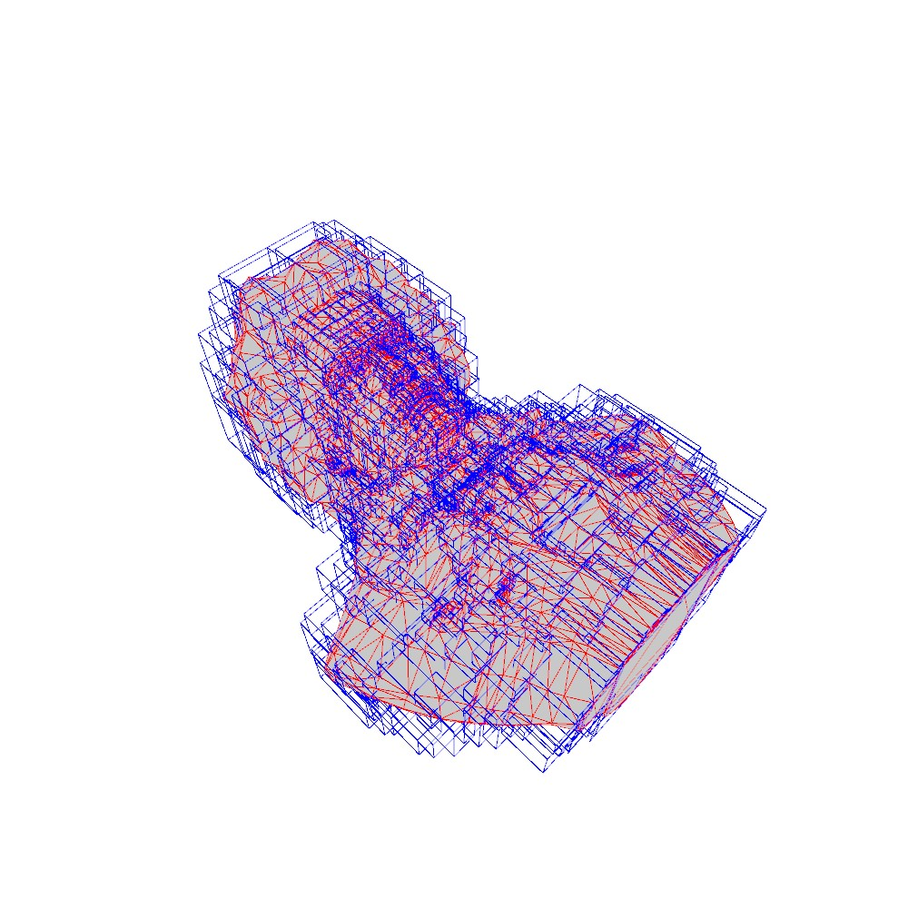

## Test Examples

example images from `textUtils`

---

#### Test1ConvexConcave | Test2ExtendTrim | Test3Skeleton
<table><tr>
    <td></td>
    <td></td>
    <td></td>
</tr></table>

#### Test4Curve | Test5LargestRect | Test6VectorTools
<table><tr>
    <td></td>
    <td></td>
    <td></td>
</tr></table>

#### Test7PolygonTools | Test8ZGraph | Test9ArcCircle
<table><tr>
    <td></td>
    <td></td>
    <td></td>
</tr></table>

#### Test10ShapeDescriptor | Test11KMeans
<table><tr>
    <td></td>
    <td></td>
</tr></table>

#### Test12JtsTransform | Test13PolyDivide | Test14ZAABBTree
<table><tr>
    <td></td>
    <td></td>
    <td></td>
</tr></table>

#### Test15ZHeatMap | Test16PolyDecomp | Test17JtsOffsetLS
<table><tr>
    <td></td>
    <td></td>
    <td></td>
</tr></table>  

#### Test18PolyVoronoi | Test19Skeleton3D
<table><tr>
    <td></td>
    <td></td>
</tr></table>

