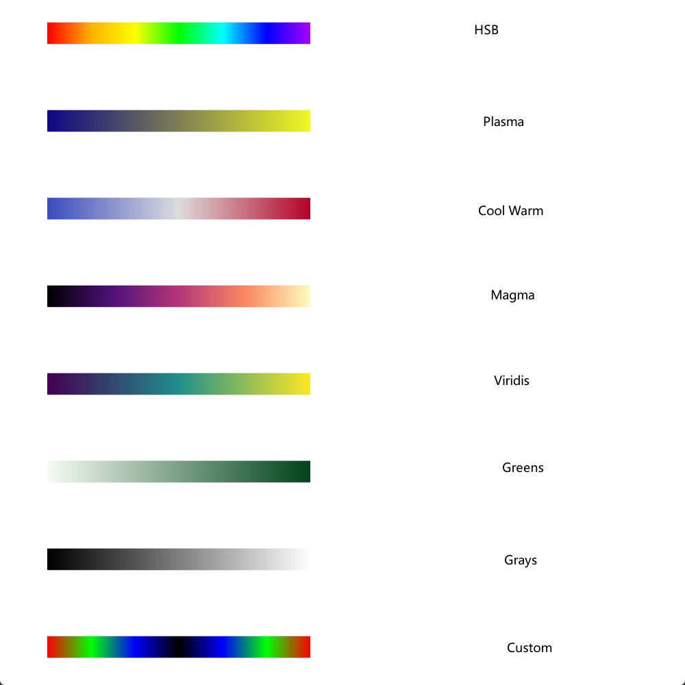
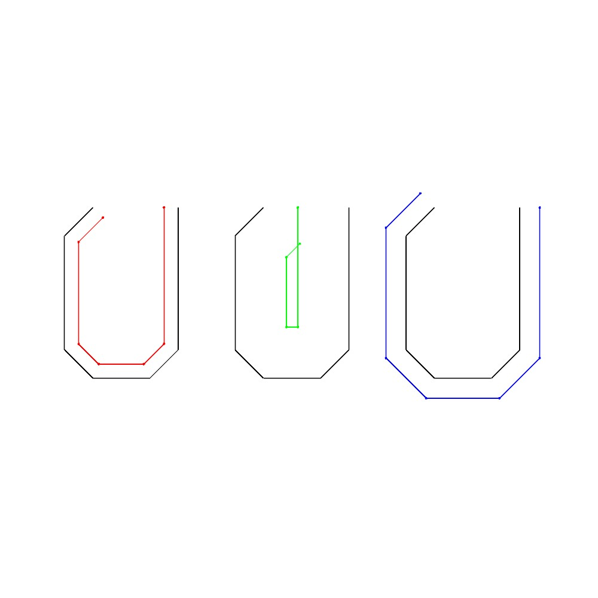

## Test Examples

example images from `textUtils`

---

#### [Test1ConvexConcave](java/testUtils/Test1ConvexConcave.java) | [Test2ExtendTrim](java/testUtils/Test2ExtendTrim.java) | [Test3Skeleton](java/testUtils/Test3Skeleton.java)
<table><tr>
    <td></td>
    <td></td>
    <td></td>
</tr></table>

#### [Test4Curve](java/testUtils/Test4Curve.java) | [Test5LargestRectQuad](java/testUtils/Test5LargestRectQuad.java) | [Test6VectorTools](java/testUtils/Test6VectorTools.java)
<table><tr>
    <td></td>
    <td></td>
    <td></td>
</tr></table>

#### [Test7PolygonTools](java/testUtils/Test7PolygonTools.java) | [Test8ZGraph](java/testUtils/Test8ZGraph.java) | [Test9ArcCircle](java/testUtils/Test9ArcCircle.java)
<table><tr>
    <td></td>
    <td></td>
    <td></td>
</tr></table>

#### [Test10ShapeDescriptor](java/testUtils/Test10ShapeDescriptor.java) | [Test11KMeans](java/testUtils/Test11KMeans.java)
<table><tr>
    <td></td>
    <td></td>
</tr></table>

#### [Test12JtsTransform](java/testUtils/Test12JtsTransform.java) | [Test13PolyDivide](java/testUtils/Test13PolyDivide.java) | [Test14ZAABBTree](java/testUtils/Test14ZAABBTree.java)
<table><tr>
    <td></td>
    <td></td>
    <td></td>
</tr></table>

#### [Test15ZHeatMap](java/testUtils/Test1ConvexConcave.java) | [Test16PolyDecomp](java/testUtils/Test16PolyDecomp.java) | [Test17JtsOffsetLS](java/testUtils/Test17JtsOffsetLS.java)
<table><tr>
    <td></td>
    <td></td>
    <td></td>
</tr></table>  

#### [Test18PolyVoronoi](java/testUtils/Test18PolyVoronoi.java) | [Test19Skeleton3D](java/testUtils/Test19Skeleton3D.java) | [Test20CircleCoverLazy](java/testUtils/Test20CircleCoverLazy.java)
<table><tr>
    <td></td>
    <td></td>
    <td></td>
</tr></table>

#### [Test21PolygonCentroid](java/testUtils/Test21PolygonCentroid.java) | [Test22ProcessingGUI](java/testUtils/Test22ProcessingGUI.java) | [Test23RawField](java/testUtils/Test23RawField.java)
<table><tr>
    <td></td>
    <td></td>
    <td></td>
</tr></table>
